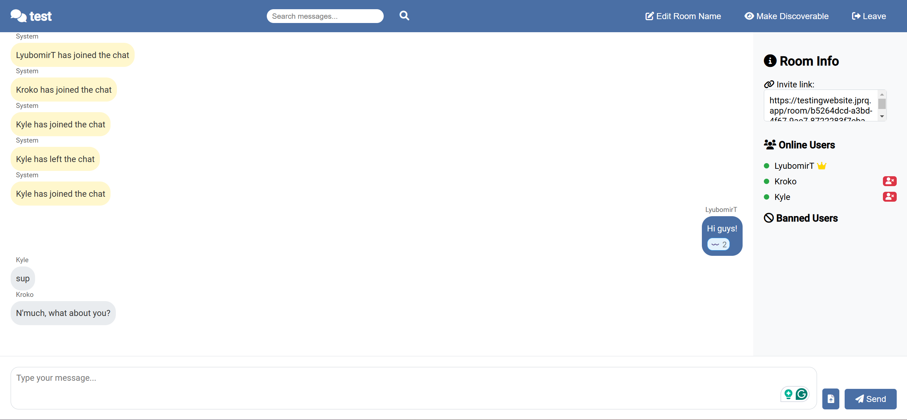

<div align="center">
  
  <i><b><p>Alert - Chatrooms for Everyone!</p></b></i>
</div>

<div align="center">

[](https://www.gnu.org/licenses/gpl-3.0)
[](https://nodejs.org)
[](https://developer.mozilla.org/en-US/docs/Web/API/WebSockets_API)

</div>

## What's Alert? 🤔

Alert is a cool, peer-to-peer chatroom application that lets you create and manage chatrooms right from your local PC and share them with the world! It's like having your own little corner of the internet where you can chat with friends, family, or anyone who's interested.

## Features 🌟

- 🏠 Create chatrooms on your local machine
- 🌐 Expose your chatrooms to the web
- 👥 Real-time messaging with multiple users
- 🔒 Decentralized and private
- 👑 Host controls for managing your room
- 🔍 Discoverable rooms (if you want!)
- 📁 File sharing capabilities
- 😄 Emoji reactions and replies

## How to Access 🔗

You can try out Alert right now at [alertchat.jprq.app](https://alertchat.jprq.app)! Just hop on, create a room or join an existing one, and start chatting!

## Setting Up Locally 🛠️

Want to run Alert on your own machine? No problem! Here's how:

1. Clone this repo:
   ```
   git clone https://github.com/LyubomirT/alert-chatroom.git
   ```

2. Navigate to the project directory:
   ```
   cd alert-chatroom
   ```

3. Install dependencies:
   ```
   npm install
   ```

4. Start the server:
   ```
   npm run start
   ```

5. Open your browser and go to `http://localhost:3000`

6. Start chatting! 🎉

## Contributing 🤝

We love contributions! If you have ideas for new features or improvements, feel free to:

- Open an issue
- Submit a pull request
- Start a discussion

Let's make Alert even more awesome together!

## Tunneling with JPRQ 🚇

Alert uses [JPRQ](https://jprq.io) to expose the website to the web. JPRQ is a simple, secure, and free tool that lets you tunnel your local servers to the internet. To use JPRQ with Alert, follow these steps:

1. Install JPRQ if you haven't already:
2. Go to `host.ini` and replace "None" with "JPRQ" in "mode"
3. Run the server with `npm run start`
4. Open your browser and go to the JPRQ link provided


## License 📄

This project is licensed under the GNU General Public License v3.0. See the [LICENSE](LICENSE) file for details.

## Screenshot 📸



## Enjoy Alert! 💬

We hope you have a blast using Alert for all your chatroom needs. Whether you're planning a surprise party, hosting a study group, or just hanging out with friends, Alert's got you covered. Happy chatting! 🎈